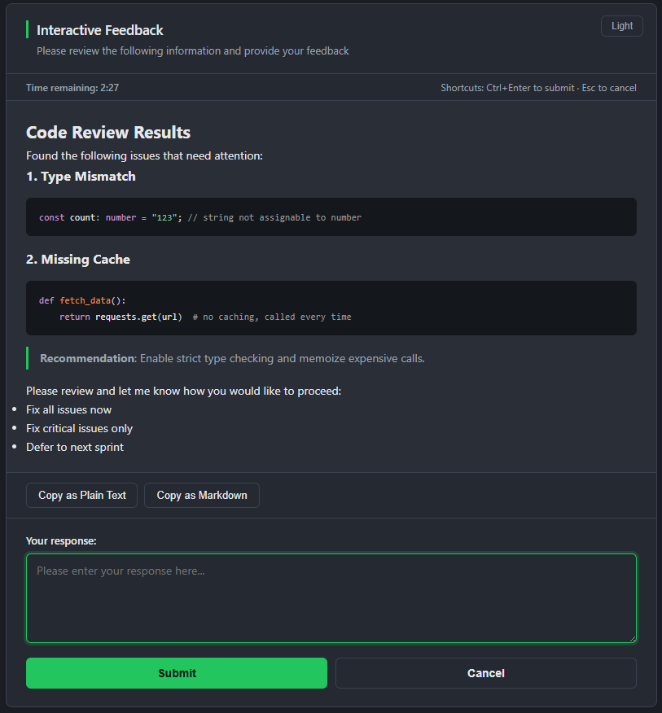

# feedback-mcp-server v2.1.0

A lightweight MCP (Model Context Protocol) server that provides interactive user feedback functionality through browser dialogs with complete Markdown rendering and syntax highlighting.

<p align="center">
  
  
  
</p>

## 🌟 Features

<p align="center">
  
</p>

### 🚀 Core Features

- ✅ **Lightweight Browser Window**: Chrome/Edge App mode, no address bar, low resource usage
- ✅ **Markdown Rendering**: Complete Markdown support with syntax highlighting
- ✅ **Fully Offline**: Prism syntax highlighting bundled locally; works without network or CDN
- ✅ **Pluggable UI Backend**: rich-text browser by default; set `FEEDBACK_UI=native` to use the system native dialog (~10MB RAM, plain text)
- ✅ **Security Hardening**: HTML sanitization (sanitize-html) against XSS, CSP security headers, listens only on localhost
- ✅ **Smart Copy**: Support for copying as plain text or Markdown format
- ✅ **Multi-language Interface**: Switch between Chinese and English interfaces
- ✅ **Timeout Control**: Configurable timeout with auto-close; timeout and cancellation are semantically separated for accurate AI judgment
- ✅ **Multi-browser Support**: Chrome / Edge (App mode), Firefox / Safari (regular window)
- ✅ **Cross-platform Support**: Windows, macOS, and Linux

## 📦 Installation

### Method 1: Using npx (Recommended)

No installation required, use directly in Claude Desktop:

```json
{
  "mcpServers": {
    "feedback": {
      "command": "npx",
      "args": ["-y", "feedback-mcp-server@latest"],
      "env": {
        "FEEDBACK_TIMEOUT": "300",
        "FEEDBACK_LANGUAGE": "en",
        "FEEDBACK_THEME": "auto"
      }
    }
  }
}
```

### Method 2: Global Installation

```bash
npm install -g feedback-mcp-server@latest
```

Configuration:

```json
{
  "mcpServers": {
    "feedback": {
      "command": "feedback-mcp-server",
      "env": {
        "FEEDBACK_TIMEOUT": "300",
        "FEEDBACK_LANGUAGE": "en",
        "FEEDBACK_THEME": "auto"
      }
    }
  }
}
```

## ⚙️ Configuration

### Environment Variables

| Environment Variable | Description | Default |
|---------------------|-------------|---------|
| `FEEDBACK_TIMEOUT` | Dialog timeout in seconds (min 5, falls back to 300 if invalid) | 300 (5 min) |
| `FEEDBACK_LANGUAGE` | Interface language (only `zh` / `en`; invalid values fall back to `zh`) | zh |
| `FEEDBACK_UI` | UI backend (optional): `browser` (rich text) / `native` (system dialog, ~10MB) / `auto` (prefer native, fall back to browser) | browser |
| `FEEDBACK_THEME` | Theme (optional): `auto` (follow system) / `light` / `dark`; manual toggle is remembered | auto |

**Recommended Configuration:**
```json
{
  "env": {
    "FEEDBACK_TIMEOUT": "300",
    "FEEDBACK_LANGUAGE": "en",
    "FEEDBACK_THEME": "auto"
  }
}
```

## 🎯 Usage

AI automatically calls the `interactive_feedback` tool, and the browser opens a dialog to display the message content.

### Tool Parameters

- `message` (required): Message content to display to users, supports full Markdown format

### Return Value

```json
{
  "submitted": boolean,   // Whether user submitted a response
  "response": string,     // User's input content
  "timedOut": boolean     // Whether timeout occurred (distinct from cancellation)
}
```

## 🎨 Interface Features

- **Markdown Rendering**: Complete support for code highlighting, tables, lists, etc.
- **Smart Copy**: Support for copying as plain text or Markdown format
- **Keyboard Shortcuts**: `Ctrl + Enter` to submit, `Esc` to cancel
- **Multi-language Interface**: Switch between Chinese and English

## 📝 Usage Examples

### Simple Confirmation

```json
{
  "message": "Do you want to continue with the delete operation? This action is irreversible."
}
```

### Code Review Results

```json
{
  "message": "## Code Review Results\\n\\nFound the following issues:\\n\\n1. **Type Error**\\n   ```typescript\\n   const x: string = 123; // Type mismatch\\n   ```\\n\\n2. **Performance Issues**\\n   - No caching used\\n   - Repeated calculations\\n\\nPlease confirm if you want to fix these issues?"
}
```

## 🛠️ Tech Stack

- **Node.js** + **TypeScript**
- **MCP SDK**: @modelcontextprotocol/sdk
- **Markdown Rendering**: marked + Prism.js (bundled locally, offline-capable)
- **Security Sanitization**: sanitize-html (strips scripts/event handlers, prevents XSS)

## 📋 System Requirements

- **Node.js** >= 18.0.0
- **Operating System**: Windows 10+ / macOS 10.15+ / Linux
- **Browser**: Chrome or Edge (recommended, App mode); Firefox / Safari also supported (regular window mode)

## 🐛 Troubleshooting

**Browser doesn't open**
- Check if Chrome, Edge, Firefox, or Safari is installed

**Firefox / Safari window shows an address bar**
- These browsers do not support App mode and open as a regular window; this is expected

**Dialog cannot submit**
- Check network connection and firewall settings

## 📋 Changelog

### v2.1.0
- 🐛 **Fixed browser submit with large text**: removed the 10000-char response length cap (kept 1MB abuse limit) — submitting 5-10KB logs no longer fails with HTTP 400
- ⏱️ **FEEDBACK_TIMEOUT now in seconds**: default 300s (5 min), more intuitive (was milliseconds)
- 🗑️ **Removed FEEDBACK_MAX_TOKENS**: hard input truncation hurt normal usage; AI now controls message length via tool description
- 🎨 **Theme follows system**: added `FEEDBACK_THEME` (`auto` default follows system / `light` / `dark`); manual toggle still remembered
- 🔧 **Leaner tool description**: reduced token usage

### v2.0.0
- 🏗️ **Pluggable UI backend architecture**: split `dialog.ts` into `core/` (types, markdown, html-template) + `backends/` (browser-backend, native-backend) behind a unified `UIBackend` interface
- ⚡ **Native backend (low memory)**: new `FEEDBACK_UI=native` invokes the system native dialog (Linux zenity / macOS osascript / Windows PowerShell WinForms), cutting memory from ~300MB to ~10MB
- 📝 **Markdown flattening**: the native backend auto-converts Markdown to readable plain text (no rich-text rendering)
- 🔧 **Config**: new `FEEDBACK_UI` env var (optional, defaults to `browser`, fully backward compatible)
- 📦 **Assets**: Windows native script `assets/native/win-feedback.ps1` bundled

### v1.2.0
- 🎨 **UI Redesign**: Removed blue-purple gradients and emojis; adopted a graphite-minimal style (neutral gray + green accent); dark theme switched to neutral graphite
- 🔒 **Security Hardening**: Added sanitize-html to sanitize Markdown output against XSS; error messages switched to textContent; added CSP / nosniff / Referrer-Policy security headers
- 🐛 **Correctness Fixes**: Unified HTTP response handling to eliminate duplicate-write races; timeout now uses a dedicated endpoint, fixing the lost `timedOut` flag; fixed broken copy buttons in Firefox; submit/cancel reentrancy guards
- 🛠️ **Reliability**: Removed the unreliable Windows `start chrome` path and unified browser detection; fixed `path`/`process` variable shadowing; version now injected from package.json
- 📦 **Fully Offline**: Prism syntax highlighting bundled locally (curated common languages); removed all CDN dependencies; works without network
- 🌐 **Engineering**: Completed "submitting/processing" i18n; `FEEDBACK_TIMEOUT` lower-bound validation, `FEEDBACK_LANGUAGE` restricted to zh/en; upgraded dependencies to fix 7 security vulnerabilities

### v1.1.2
- Enhanced error handling and retry mechanism
- Added theme switching, window position memory, shortcut hints
- Enhanced browser compatibility (Safari/Firefox support)

---

<div align="center">
  <sub>
    <p>Made with ❤️ by <a href="https://github.com/NianLog/feedback-mcp">NianLog</a></p>
  </sub>
</div>
